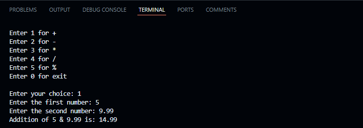
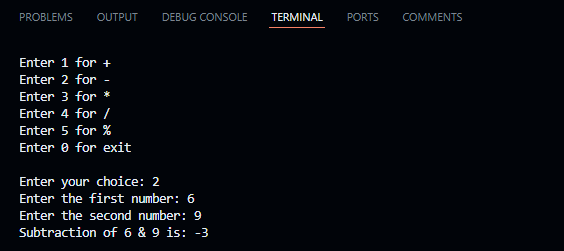
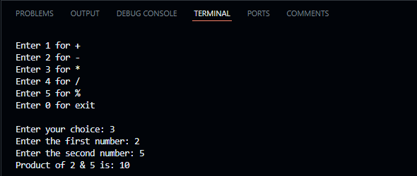
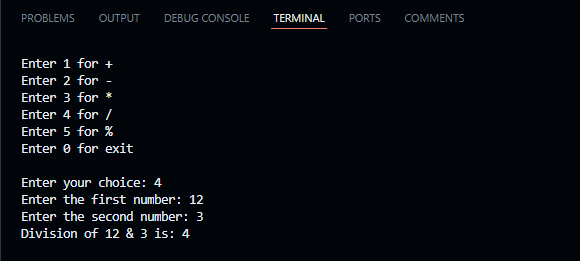
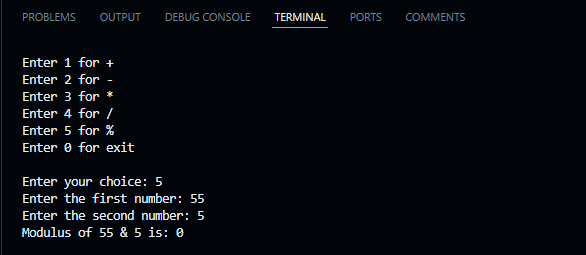
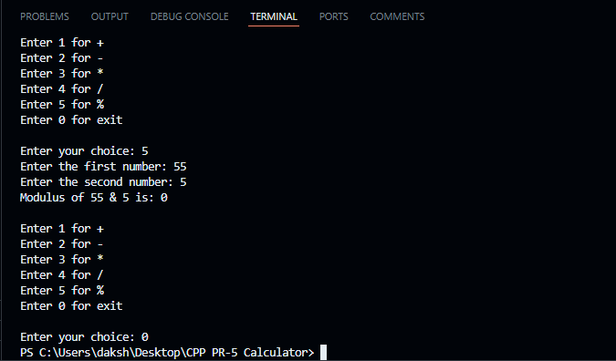
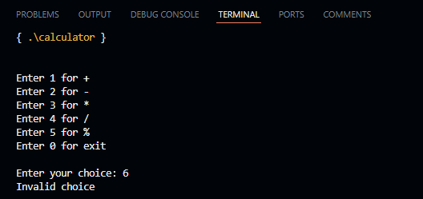

# Calculator Program

This is a simple calculator program written in C++ that performs basic arithmetic operations using user-defined functions (UDF).

## Output

1.Sum

2.Difference

3.Product

4.Division

5.Modulus

6.Exit

7.Invalid choice

